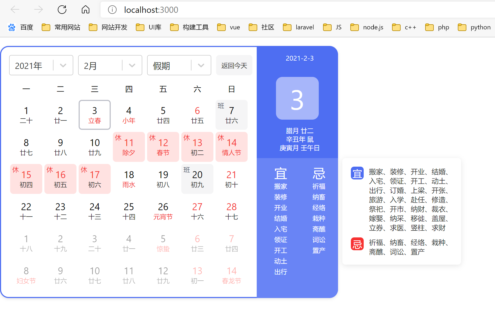

# baidu-calendar (一款仿百度日历组件,react 版本)

# baidu-calendar

基于 react+react-hooks 实现的百度日历组件。宜忌算法尚未实现，欢迎 pr。

>vue3版:[https://github.com/qiuquanwu/vue-baidu-calendar](https://github.com/qiuquanwu/vue-baidu-calendar)

> [在线demo](https://isfive.gitee.io/baidu-calendar/)

因为react版本问题
## 先安装react-select
```
$ npm install react-select --save
```
## 再安装

```
$ npm install baidu-calendar --save
```

## 使用

App.jsx

```jsx
import React, { useState } from "react";
import BaiduCalendar from "baidu-calendar";
import "./App.css";
function App() {
  //设定日期,必填
  let [date, setDate] = useState("2021-2-5");
  //设定年份范围
  let [range, setRange] = useState([2015, 2026]);
  //时间监听,必传
  const change = (obj) => {
    console.log(obj);
  };
  return (
    <div className="app">
      <BaiduCalendar date={date} range={range} change={change} />
    </div>
  );
}

export default App;
```

## 演示


